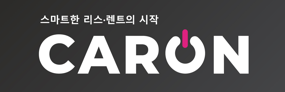

# CARON - Premium Mobility Solutions



CARON은 신차 장기렌트, 오토리스, 그리고 리스/렌트 승계 서비스를 제공하는 프리미엄 모빌리티 금융 플랫폼입니다. 복잡한 자동차 금융 절차를 투명하고 스마트하게 해결하여 고객에게 최적의 카라이프를 선사합니다.

## 🚀 Key Features

- **신차 장기렌트/리스**: 초기 비용 부담 없는 맞춤형 견적 서비스
- **리스/렌트 승계**: 위약금 없는 계약 이전 및 합리적인 차량 인수 솔루션
- **스마트 매칭**: 데이터 기반의 최적 승계 매물 연결
- **프리미엄 UI/UX**: 사용자 중심의 세련되고 직관적인 인터페이스

## 🛠 Tech Stack

- **Frontend**: HTML5, Vanilla CSS, JavaScript (ES6+)
- **Backend**: Node.js, Express
- **View Engine**: EJS (Embedded JavaScript)
- **Animation**: GSAP, AOS (Animate On Scroll), ScrollTrigger
- **Deployment & Tools**: Git, GitHub

## 📂 Project Structure

```text
├── app.js              # Express 서버 설정 및 라우팅
├── package.json        # 의존성 관리
├── public/             # 정적 리소스 (CSS, JS, Images, Favicon)
│   ├── css/            # 스타일시트
│   ├── js/             # 클라이언트 스크립트
│   └── images/         # 서비스 이미지 및 로고
└── views/              # EJS 템플릿 파일
    ├── layout/         # 공통 레이아웃 (Header, Footer, Base)
    ├── index.ejs       # 메인 페이지
    ├── about.ejs       # 회사소개 페이지
    └── succession.ejs  # 리스/렌트 승계 페이지
```

## 💻 Getting Started

1. **저장소 클론**
   ```bash
   git clone https://github.com/eunsoo8606/CARON.git
   cd CARON
   ```

2. **의존성 설치**
   ```bash
   npm install
   ```

3. **서버 실행**
   ```bash
   npm start
   ```
   서버가 실행되면 `http://localhost:3000`에서 확인하실 수 있습니다.

## 📄 License

이 프로젝트는 CARON의 자산이며, 무단 복제 및 배포를 금합니다.
